<!-- ═══════════════════════════════════════════════════════════════════ -->
<!-- HERO SECTION — Animated banner with name, subtitle, floating orbs -->
<!-- ═══════════════════════════════════════════════════════════════════ -->

<!-- ═══════════════════════════════════════════════════════════════ -->
<!-- TECH STACK SECTION — Animated glowing technology cards         -->
<!-- ═══════════════════════════════════════════════════════════════ -->

<!-- ═══════════════════════════════════════════════════════════════ -->
<!-- ABOUT ME SECTION — Terminal-style glassmorphism panel          -->
<!-- ═══════════════════════════════════════════════════════════════ -->

<!-- ═══════════════════════════════════════════════════════════════════ -->
<!-- FEATURED PROJECTS — Rich project cards with animated glow borders -->
<!-- ═══════════════════════════════════════════════════════════════════ -->

<!-- ═══════════════════════════════════════════════════════════════ -->
<!-- GITHUB STATS — Cohesive themed statistics                      -->
<!-- ═══════════════════════════════════════════════════════════════ -->

<!-- ═══════════════════════════════════════════════════════════════ -->
<!-- CURRENT FOCUS — What I'm building and exploring                -->
<!-- ═══════════════════════════════════════════════════════════════ -->

<!-- ═══════════════════════════════════════════════════════════════ -->
<!-- SOCIAL LINKS — GitHub · LinkedIn · Email                       -->
<!-- ═══════════════════════════════════════════════════════════════ -->

<!-- ═══════════════════════════════════════════════════════════════════ -->
<!-- FOOTER — Animated scanline + terminal aesthetic                  -->
<!-- ═══════════════════════════════════════════════════════════════════ -->

